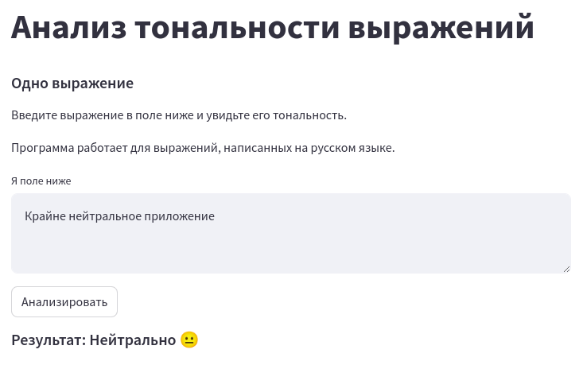
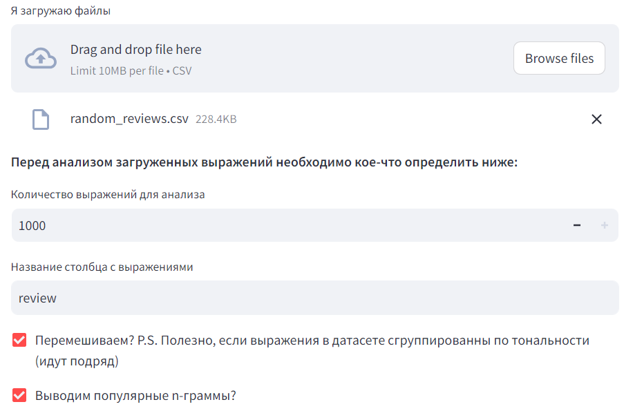
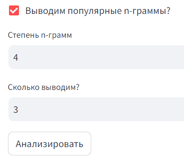
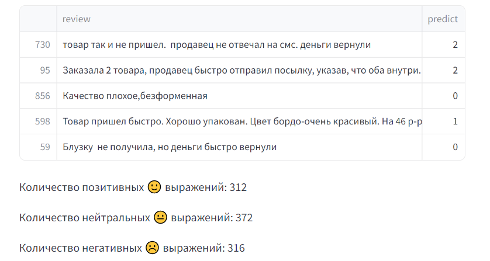
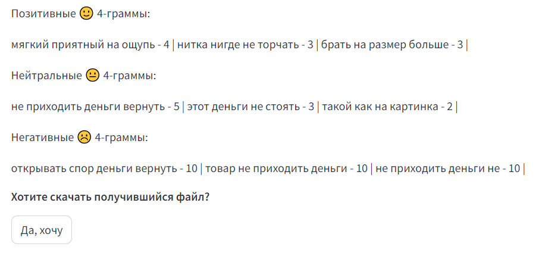
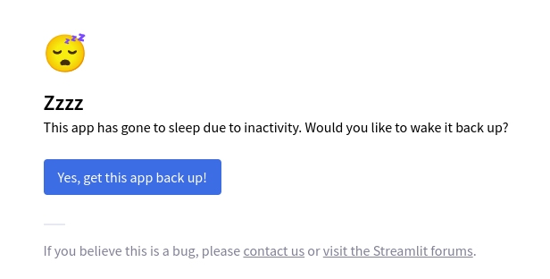

# Анализ тональности выражений

Приложение позволяет проводить анадиз тональности выражений на русском языке.

Воспользоваться им можно по ссылке - https://ru-text-sentiment-analysis.streamlit.app/

## Пример работы

### Одно выражение

Приложение выдаёт оценивает выражение и выдаёт один из следующих результатов:
* Положительно 🙂 (1)
* Нейтрально 😐 (0)
* Негативненько ☹️ (2)

Пример нейтрального выражения:

### Много выражений

Также приложение поддерживает анализ до 1000 выражений, загружаемых с помощью файла формата .csv

Загрузка и настройка:

Настройка вывода n-грамм: 

Вывод результата:

Вывод n-грамм:

## Приложение не отображается
Если приложение не отображается, нажмите на кнопку перезагрузки на экране - после пары минут оно станет снова доступно.

